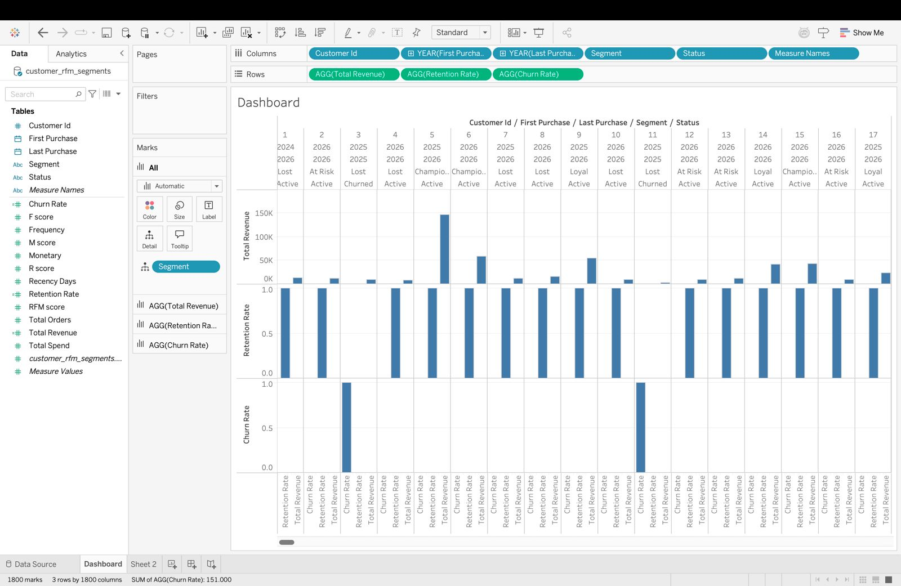
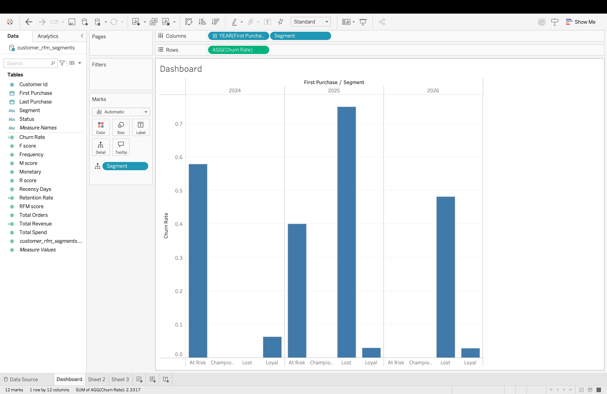
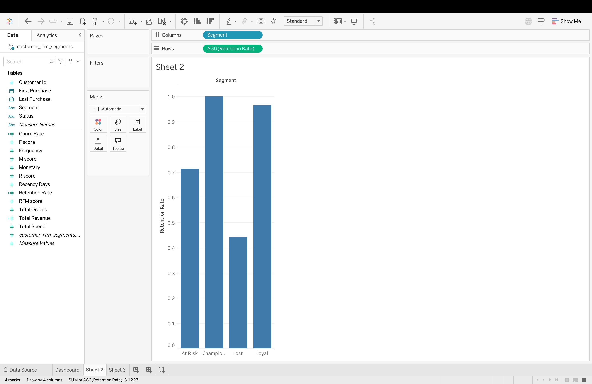
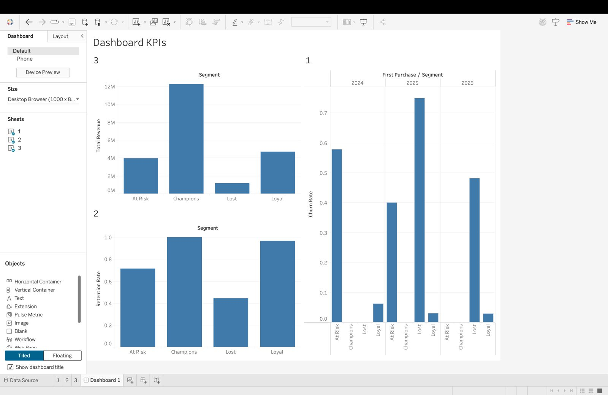
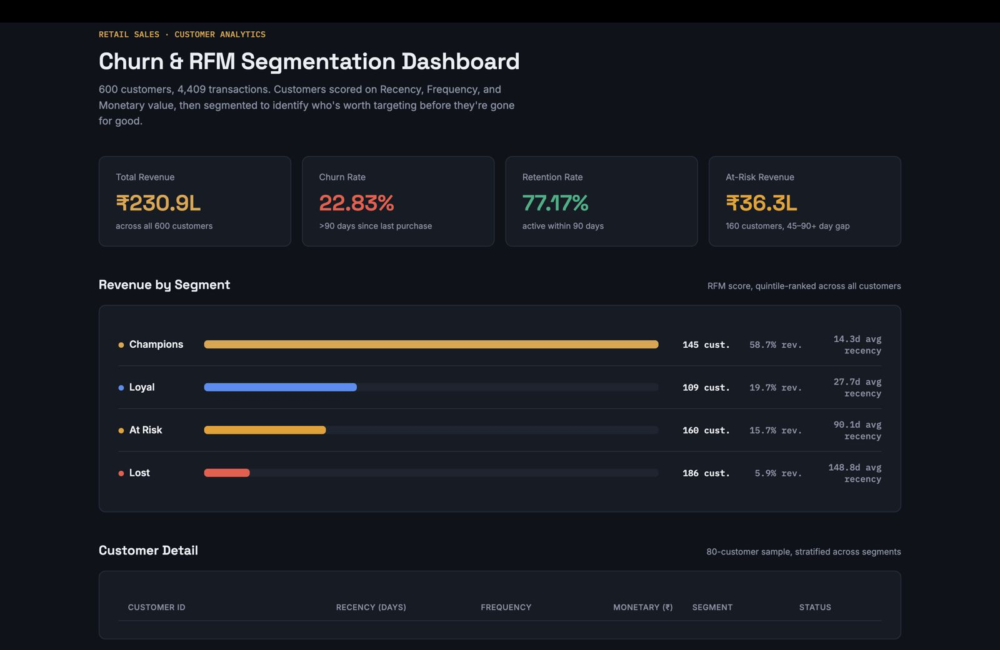

# Retail Sales Business Intelligence Dashboard

A SQL + Python + Tableau pipeline that turns a vague business question —
*"why are customers churning?"* — into a measurable definition, a
customer segmentation model, and a specific, defensible recommendation.

## Architecture

```
Raw transactions (CSV)
      ↓
SQL (customer-level aggregation, window functions, LEFT JOIN churn detection)
      ↓
Python / Pandas (data quality checks, RFM feature engineering, segmentation)
      ↓
Tableau (interactive dashboard)
      ↓
Business recommendation
```

## Dataset

Synthetic but behaviorally realistic: 600 customers, 4,409 transactions,
generated with five hidden behavior archetypes (loyal / regular / occasional
/ one-time / lapsed) so recency, frequency, and spend vary the way real
retail data does. See `generate_data.py`.

## Key results

- **Churn rate: 22.83%** (>90 days since last purchase) | **Retention: 77.17%**
- The 90-day threshold was chosen from the recency distribution (median 39
  days, 90th percentile ~241 days), not picked arbitrarily.
- RFM segmentation (Recency / Frequency / Monetary, quintile-scored):

  | Segment | Customers | % of Base | % of Revenue |
  |---|---:|---:|---:|
  | Champions | 145 | 24.2% | 58.7% |
  | Loyal | 109 | 18.2% | 19.7% |
  | At Risk | 160 | 26.7% | 15.7% |
  | Lost | 186 | 31.0% | 5.9% |

- **Recommendation:** target customers in the 45–90 day "at-risk" window
  with a win-back campaign before they cross into Lost — they're still
  reachable and have already proven real spend, unlike the Lost segment
  where average recency is ~149 days and reactivation is far harder.

## Dashboard screenshots

| | |
|---|---|
|  |  |
|  |  |
|  | |

## Repo contents

| File | Purpose |
|---|---|
| `generate_data.py` | Generates `customers.csv` / `transactions.csv` |
| `retail_sql_queries.sql` | Core SQL queries (SQLite syntax) |
| `retail_sql_queries_mysql.sql` | Same queries in MySQL syntax |
| `retail_analysis.py` | Full pipeline: SQL aggregation → Pandas RFM/churn scoring → CSV export |
| `customer_rfm_segments.csv` | Output: every customer scored and segmented |
| `segment_summary.csv` | Output: revenue/customer counts per segment |
| `retail_results.md` | Full write-up of findings |
| `retail_dashboard.twb` | Tableau workbook (open in Tableau Desktop/Public) |
| `retail_dashboard.html` | Static HTML preview of the dashboard — no Tableau needed to view |

## Run it yourself

```bash
pip install pandas numpy
python generate_data.py      # regenerates the dataset (optional, CSVs already included)
python retail_analysis.py    # runs the full pipeline, prints churn/segment numbers
```

Open `retail_dashboard.twb` in Tableau to explore the interactive version,
or `retail_dashboard.html` in any browser for a quick static view.

## Honest notes

This is a self-directed learning project built on synthetic data, not a
live company dataset — the data generation logic is fully visible in
`generate_data.py`. The 90-day churn threshold and RFM segment boundaries
are analytical judgment calls, explained and justified in `retail_results.md`,
not universal constants.